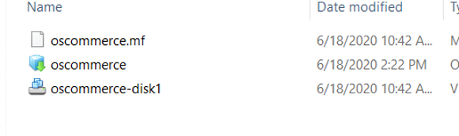

## Introduction

Now we will extend your on-prem app to use OCI services

## Modify our Route Rules

First we will go to Menu, VMWare solution, Software Defined Data Center, and select our SDDC deployment. Now copy the NSX EDge IP Adress and store it in your notepad

    

Goto to your VCN where you have public and private subnets

Open the VCN, on the left side select NAT Gateway and click Create NAT Gateway

Now select the subnets on the left and select the VMWare subnet

Click on the route table that is associated with this subnet and click Add Route Rule

With target Type as NAT Gateway, destination CIDR as 0.0.0.0/0 and Target NAT Gateway as NAT-G (long lost cousin on Parle-G), click Add Route Rule

Again click add route, now with Target Type as Private IP, destination CIDR as 172.0.0.0/24 and Target will be the NSX EDge IP Adress that we copied in our notes bofore, click Add Route Rule.

## Create Load Balancer

Navigate to menu --> Networking --> Load Balancer  and click Create Load Balancer

Give a name to your Load Balancer, select visibility Type as Public, VCN will be the same VCN we used for our VMWare solutions, subnet will be a regional subnet we have, now click next 

Now load balancer policy will be the default Weighted Round Robin, health check Policy will be the default, click Next

Give a Listener name, Type of Traffic will be HTTP, port will be 80 and now click Submit
