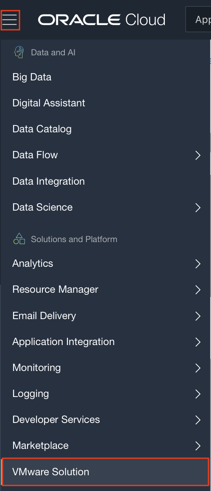
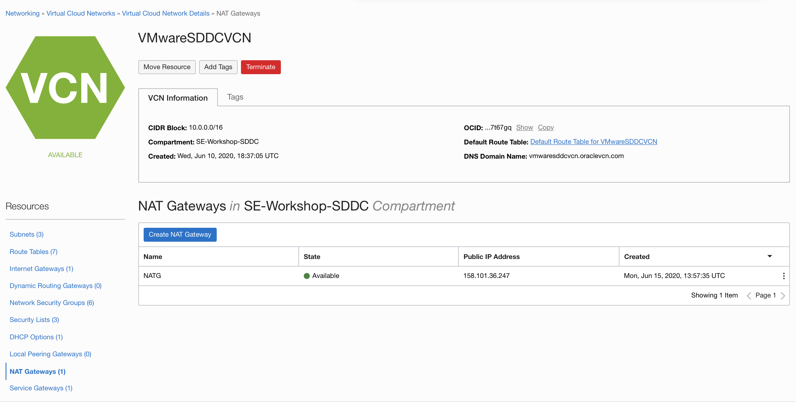
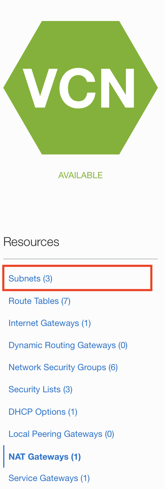
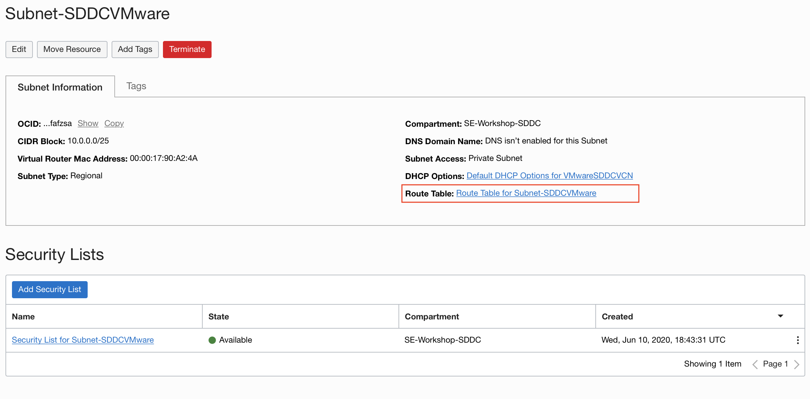
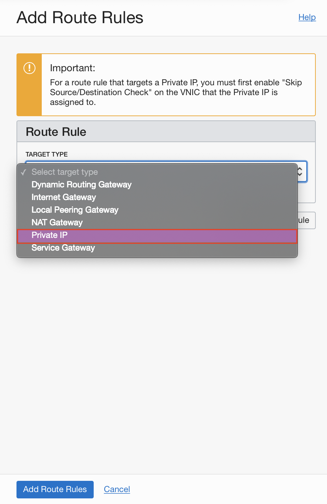
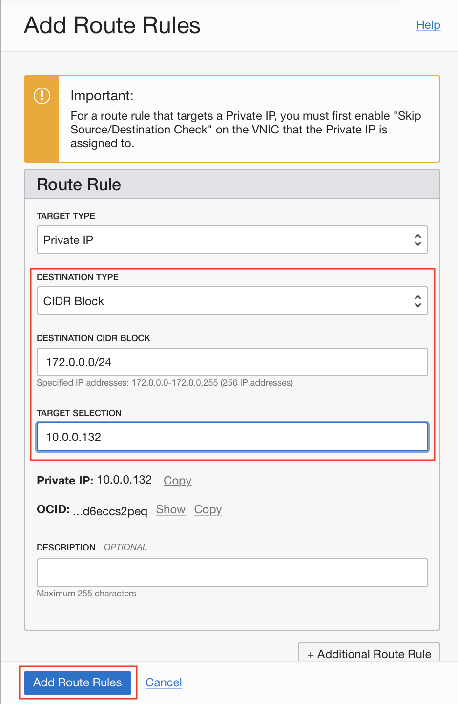
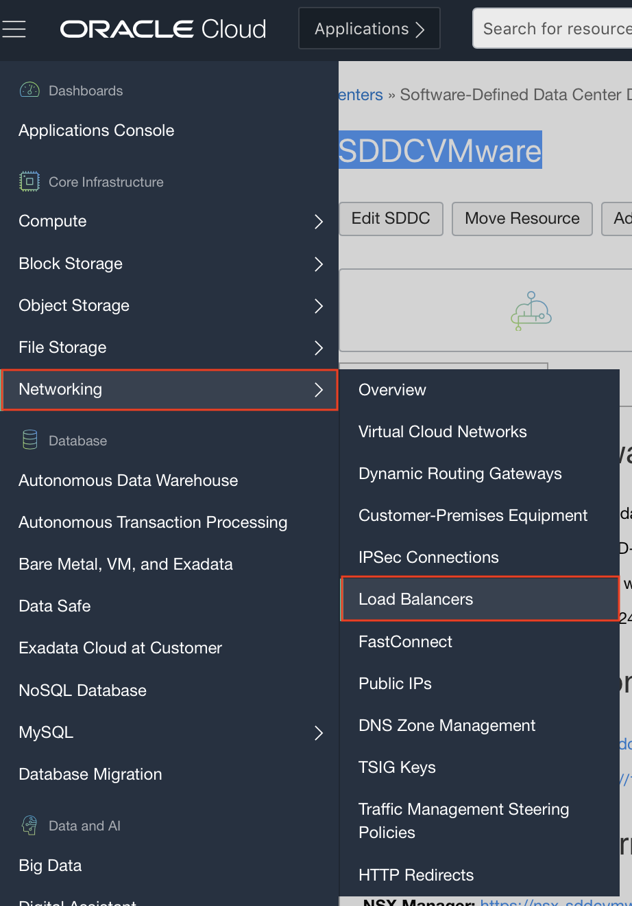
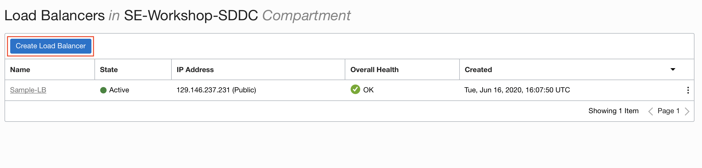
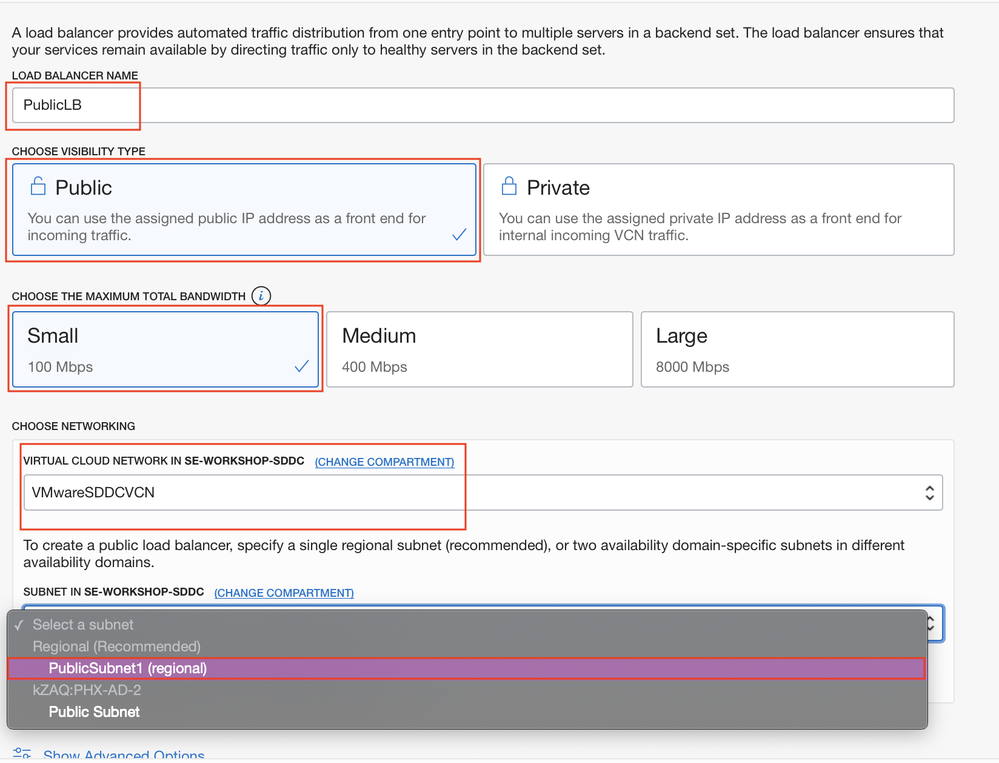
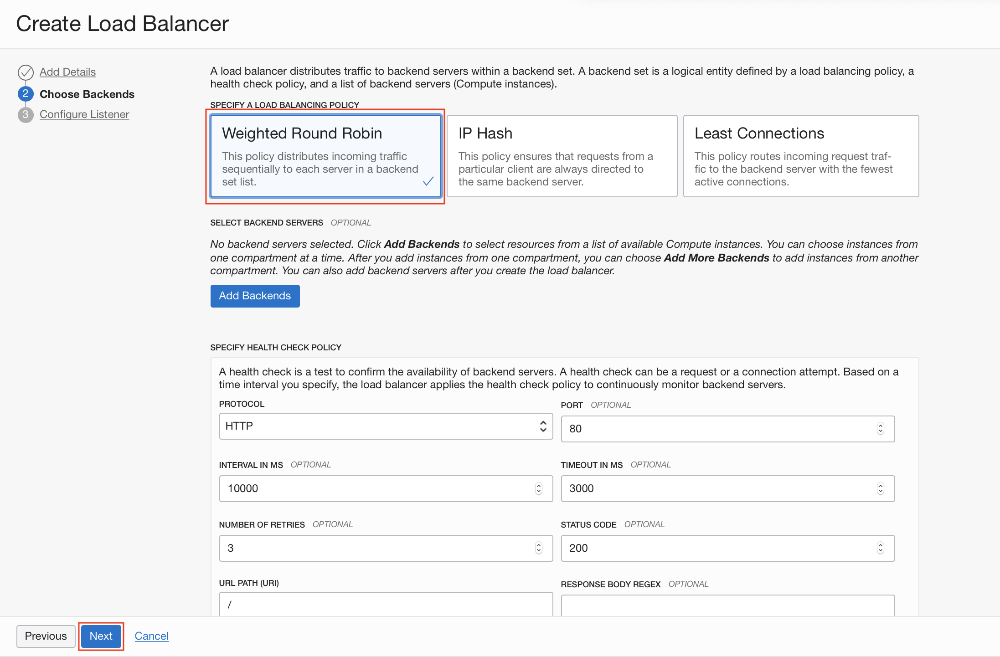

# Extending your Application deployed in OCVS with OCI Service

## Introduction

In this lab, we will extend the application that we deployed in the VMWare SDDC in Lab 300 by integrating it with OCI services like File Storage Service and Load Balancer.

## Objectives
- Setup a load balancer in front of your oscommerce application
- Allow file sharing with other VMs outside of your SDDC through File Storage Service.
- Enable REST end points for your application data using Oracle Integration Cloud

## Required Artifacts
- Required IAM permissions to create a File Storage Service instance, a Load Balancer and an Integration Cloud instance.

## Use Cases

### Use Case 1: Set up Load Balancer in front of osCommerce  Application

- Make note of your SDDC NSX Edge IP Address

    We will begin by making a note of the IP address of the NSX Edge. You will need it, later. Go to **Menu** and scroll down to **VMWare solution**.
    
    

    Select your Software Defined Data Center deployment.
    
    

    Now, copy the **NSX Edge IP Address** and store it in your notepad. You will need it to setup the route rule.

    

- Create a **Network Address Translation (NAT) Gateway**

    In order to allow the SDDC which is sittng in a private subnet, to communicate with the internet, we will need a NAT Gateway.

    Go to the **Menu**, under **Networking**, select **Virtual Cloud Networks**.

    

    Select your VCN from the list.

    

    From the **Resources** section on the left side of the web page, select **NAT Gateway**.

    
    
    Click on the **Create NAT Gateway** button.

    

    Provide a name and compartment for the NAT gateway and hit the **Create NAT Gateway** button on the iframe.
    
    

    

    You have successfully created a NAT Gateway. Now, let us attached it to the private subnet where your SDDC resides.
    
- Attach the **NAT Gateway** to the SDDC subnet

    From the **Resources** section on the left side of the web page, select **Subnets**.

    

    From the list, select the private subnet.
    
    

    We will now modify the route rules for the SDDC. To begin, click on the link to the associated **Route Table** in the panel at the top.

    

    Click on the **Add Route Rules** button.

    

    Select the **Target Type** as **NAT Gateway**, set the **Destination CIDR** as 0.0.0.0/0 and choose the NAT Gateway that you just created as the Target NAT Gateway. 

    
    

    

    Select **Add Additional Route Rule** to add another rule. This time set the **Target Type** as **Private IP**, **Destination CIDR** as 172.0.0.0/24 and **Target** will be the NSX EDge IP Adress that we had copied earlier. After this, click on the **Add Route Rules**.

    

    

    

- Create Load Balancer

    Navigate to the menu. Under **Networking**, select the Load Balancer. On the next page, hit the **Create Load Balancer** button.

    
    

    In the details page, provide a name to your Load Balancer and set the **Visibility Type** to Public. Let the **Maximum Total Bandwidth** be Small. The VCN should be the same, as our VMWare solution. The subnet should be a regional subnet in the same VCN. Once, all of this done, click on **Next**. 

    

    Now, let **Load Balancer policy** be the default **Weighted Round Robin**. **Health check Policy** will also be the default. We will add the backend sets, later. So, simply click on **Next**.

    
    

    On the next screen, provide a name for your listener. The Traffic will be **HTTP** and the port will be 80. Now, click on **Submit**.

    The load balancer should be up and running, shortly.
    
    

    Go to the menu on the left hand side and click on **Backend Sets**. Thereafter, click on the **Create Backend Set**. 

    In the menu that will open, specify the name. Fill out the health check, as shown in the picture, below. Then, hit **Create**. 

    

    We will now add a rule in the security list of the subnet with our load balancer to accept requests from  the internet.

    Click on the **Security List** for the subnet and go to **Ingress Rules**. Hit the **Add Ingress Rules** button and allow TCP traffic from 0.0.0.0/0 on port 80.

    

    Now, we will configure the Network Security Groups to allow traffic from the load balancer. Return to your VCN. 

    
    

    In the **Resources** menu on the left side of the screen, click on **Network Security Groups**.

    

    Choose the **NSG for NSX Edge Uplink**.

    

    Now, click the **Add Rule** button. Once, we add all the rules, your list would look similar to what we have below.

    

    Add the first rule, as shown in the screenshot below. Once you click on **Add**, you will see a rule in the list.

    
    

Your Load Balancer is now working on top of your application.
    
### Use Case 2: Create a File Storage Network accessible inside the SDDC and in OCI

- Create a file system.

    Click on the navigation menu. Under **Core Infrastructure**, click on **File Storage** and then **File Systems**.

    
    
    Click on the **Create File Systems** button.

    
    
    Click on the **Edit Details** option to the right of **File System Information**.

    

    Provide a name and select an **Availability Domain**. Let the **Encryption** be set to the default value. 

    

    Now, **Edit Details** for the **Mount Target**.

    

    Select the **Create New Mount Point Target** radio button. Give the Mount Point Target a name. Choose the same VCN, as your SDDC and select the Private Regional subnet and click on the **Create** button.

    
    
    
    
    You should be able to a screen, similar to the one below.

    
    
    Click on the 3 vertical dots in front of the **Export** and select **Mount Commands** from the menu that pops up.

    

    Change the **Image** to **Ubuntu**.
    

    As shown previously, open the mentioned ports in the private subnet containing the SDDC and also in subnet containing your Linux machine that will be sharing this file system. Please note that you might not have to open the egress rules, if you already have traffic open to 0.0.0.0/0 on all ports.
    
    
    

    Your subnets will have a long list of rules, all of which have a purpose.

    Subnet 1 Rules
    
    
    

    Subnet 2 Rules
    
    

    Now, access your SDDC, as shown in Lab 100 and launch your Ubuntu Instance.

    
    

    After the log in to the machine. Run the three commands, as shown

        sudo apt-get install nfs-common

        sudo mkdir -p /mnt/SDDC-FSS

        sudo mount <replace with correct IP>:/SDDC-FSS /mnt/SDDC-FSS

    

    After mounting the file system. Switch your directory to the file system and create a file. Use the ls command to confirm its presence.

        cd /mnt/SDDC-FSS

        sudo touch lab.txt

        ls

    
    

    Open the file for editing and enter a custom message. 

    
    

    Go back to the file system export and fetch the commands for Oracle Linux.

    

    Follow a similar process to login to your Oracle Linux machine and to mount the file system using the aforementioned commands. You can now access the same file.

    