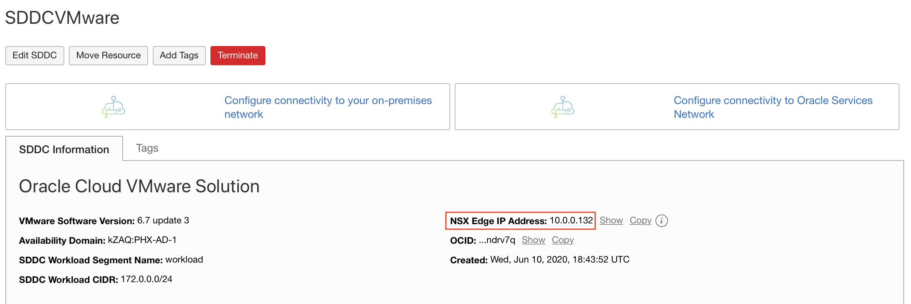
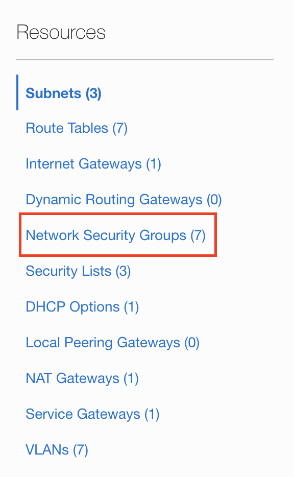
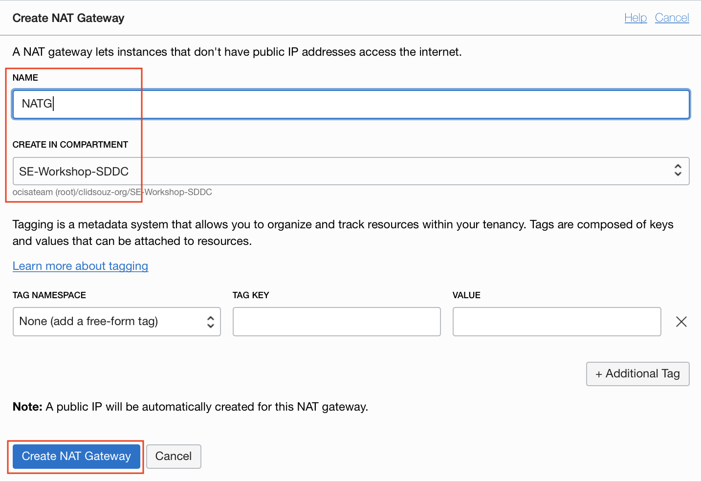
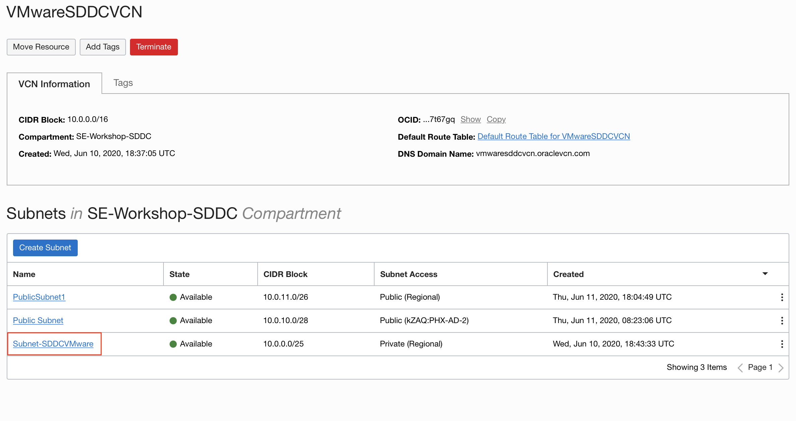
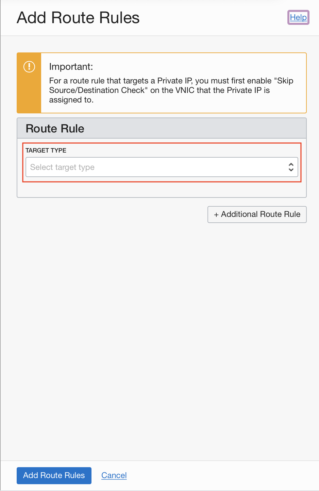
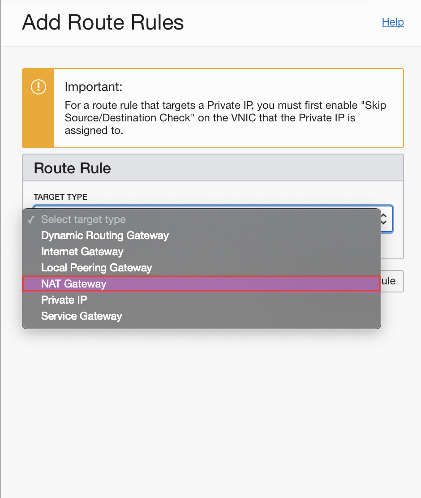
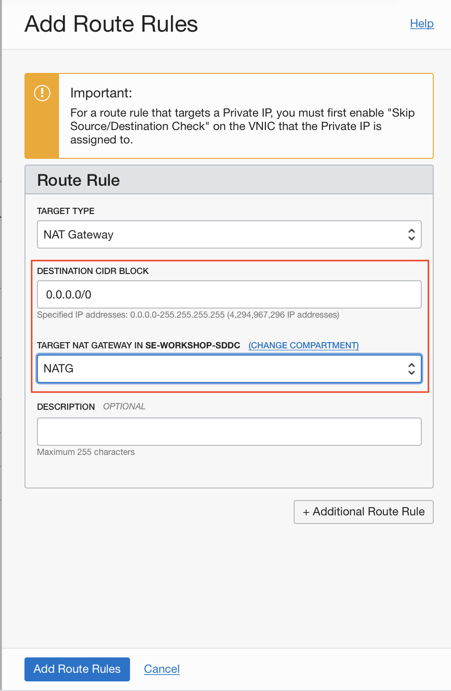
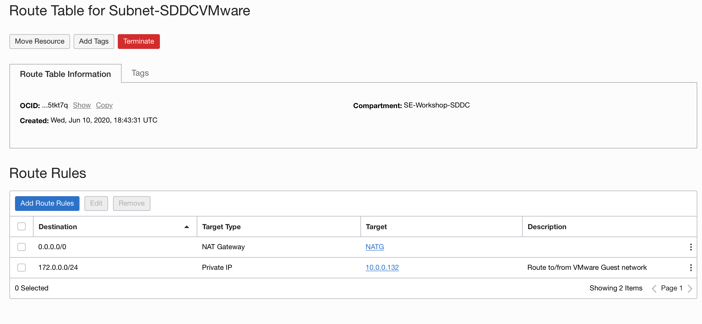

# Extending your Application deployed in OCVS with OCI Service

## Introduction

In this lab, we will extend the application that we deployed in the VMWare SDDC in Lab 300 by integrating it with OCI services like File Storage Service, Load Balancer and Oracle Integration Cloud. 

## Objectives
- Setup a load balancer in front of your oscommerce application
- Allow file sharing with other VMs outside of your SDDC through File Storage Service.
- Enable REST end points for your application data using Oracle Integration Cloud

## Required Artifacts
- Required IAM permissions to create a File Storage Service instance, a Load Balancer and an Integration Cloud instance.

## Steps

### Step 1: Set up Load Balancer in front of osCommerce  Application

- Make note of your SDDC NSX Edge IP Address

    We will begin by making a note of the IP address of the NSX Edge. You will need it, later. Go to **Menu** and scroll down to **VMWare solution**.
    
    

    Select your Software Defined Data Center deployment.
    
    

    Now, copy the **NSX Edge IP Address** and store it in your notepad. You will need it to setup the route rule.

    

- Create a **Network Address Translation (NAT) Gateway**

    In order to allow the SDDC which is sittng in a private subnet, to communicate with the internet, we will need a NAT Gateway.

    Go to the **Menu**, under **Networking**, select **Virtual Cloud Networks**.

    

    Select your VCN from the list.

    

    From the **Resources** section on the left side of the web page, select **NAT Gateway**.

    
    
    Click on the **Create NAT Gateway** button.

    

    Provide a name and compartment for the NAT gateway and hit the **Create NAT Gateway** button on the iframe.
    
    

    

    You have successfully created a NAT Gateway. Now, let us attached it to the private subnet where your SDDC resides.
    
- Attach the **NAT Gateway** to the SDDC subnet

    From the **Resources** section on the left side of the web page, select **Subnets**.

    

    From the list, select the private subnet.
    
    

    We will now modify the route rules for the SDDC. To begin, click on the link to the associated **Route Table** in the panel at the top.

    

    Click on the **Add Route Rules** button.

    

    Select the **Target Type** as **NAT Gateway**, set the **Destination CIDR** as 0.0.0.0/0 and choose the NAT Gateway that you just created as the Target NAT Gateway. 

    
    

    

    Select **Add Additional Route Rule** to add another rule. This time set the **Target Type** as **Private IP**, **Destination CIDR** as 172.0.0.0/24 and **Target** will be the NSX EDge IP Adress that we had copied earlier. After this, click on the **Add Route Rules**.

    

    

    

- Create Load Balancer

    Navigate to the menu. Under **Networking**, select the Load Balancer.
    
    
