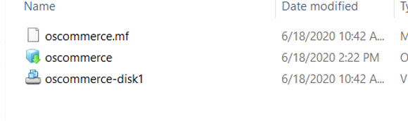

## Introduction

In this lab, we will import the on-premises VMWare environment that we had exported in Lab 200 to OCVS. 

## Objectives
- Import an OVF file and access the environment as part of the Oracle Cloud VMWare Service.

## Required Artifacts
- Access to the Object storage bucket used to store the exported workload from Lab 200.
- The deployed OCVS environment from Lab 100.

## Steps

### STEP 1: Import the osCommerce OVF into Oracle Cloud VMware Service

- Use the pre-authenticated request URL from Lab 200 to download the zipped ovf file.  Unzip to extract the 3 ovf files on your computer.

    

- Use the RDP client to connect to the bastion host. Now, login to the vSphere client of your OCVS platform and enter the credentials. You can get the vCenter server details from your OCVS page.

    

- Go to **Menu** and select **Hosts and Clusters**.

    

- Right click on the Host in the VMware Host client Inventory and Select **Deploy OVF Template**.

    

- Select the .ovf and VMDK file from the unzipped folder.

    

- Enter a name and select a location for your VM and select a compute resource. Review the details.

    
    
    

- Now, select the storage. After doing so, choose the Workload network on the next screen.

    
    

- Click on **Finish** to complete the deployment.

    

- Select the VM that you just imported and power it on.

    

- Launch the web console and login to the VM. Open Firefox and enter **localhost/catalog/index.php** and check for the oscommerce index page.

     

