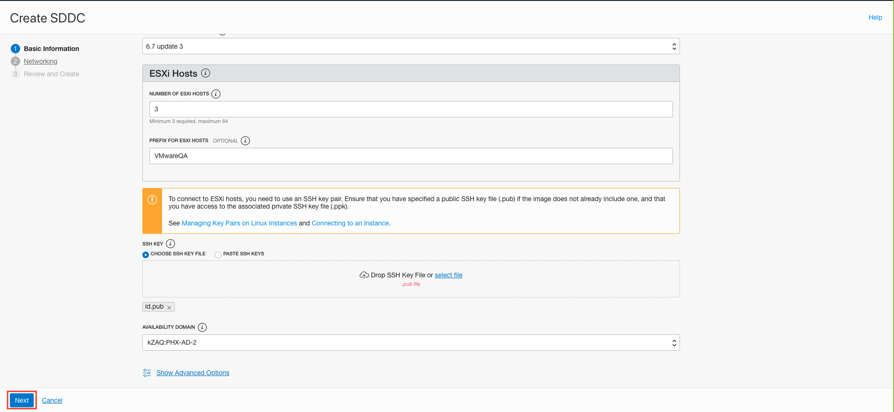
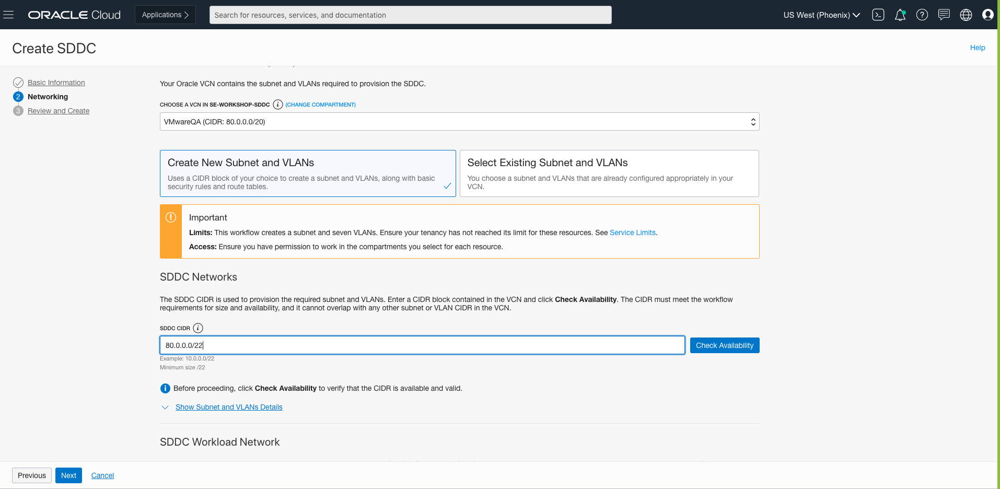
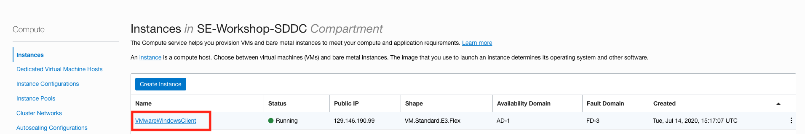

## Introduction

This lab will get you started with the Oracle Cloud VMware Service. In this lab, you will provision a Oracle Cloud VMware Stack including the Oracle Cloud Infrastructure resources needed to host the solution.

To log issues and view the Lab Guide source, go to the [github oracle](https://github.com/oracle/learning-library/issues/new) repository.

## Objectives

As a System Administrator or application developer:

- Rapidly deploy OCVS on Oracle cloud Infrastructure 
- Manage your VMware workloads

## Required Artifacts

- An Oracle Cloud Infrastructure account with service limit of atleast 3 Bare Metal DenselIO 2.52 compute shape.
- A Virtual Cloud Network with a recommended CIDR size of /22 or greater.

# Provisioning Oracle Cloud VMware Solution

In this section, you will be provisioning OCVS using the Oracle cloud infrstructure console.

## Steps

### STEP 1: Create an SDDC

**Sign in to the OCI console**

-  Open the navigation menu by clicking on the hamburger menu icon on the top left of the screen.

-  Under **Solutions and Platform**, click on **VMware Solution**.

- Select the compartment where you wish to deploy the solution from the **Compartment** drop down on the left side of the screen.

- Click on the **Create SDDC** button.

**Note:** Oracle Cloud Infrastructure allows logical isolation of users within a tenancy through Compartments. This allows multiple users and business units to share an OCI tenancy while being isolated from each other.

**If you have chosen a compartment where you do not have the required privileges, then you will not be able to provision the Solution in it.**

More information about Compartments and Policies is provided in the OCI Identity and Access Management documentation [here](https://docs.cloud.oracle.com/iaas/Content/Identity/Tasks/managingcompartments.htm?tocpath=Services%7CIAM%7C_____13).

-  On the Basic information page, provide the following details:-
    - SDDC Name: A descriptive name for the SDDC. This name has to be unique among all SDDCs across all compartments in the region. The name must have 1 to 16 characters, must start with a letter, can contain only alphanumeric characters and hyphens (-), and is not case-sensitive.
    - SDDC Compartment: The deployment compartment. The destination compartment can be changed from here, as well.
    - VMware Software Version: The version of bundled VMware software that you want to install on the ESXi hosts. The software bundle includes vSphere, vSAN, and NSX components. 
    - Number of ESXi Hosts: The initial number of ESXi hosts to create in the SDDC. This number has to be at least 3 and can be at most 64. 
    
    

    **Note:** The Oracle Cloud VMware Solution supports addition and deletion of ESXi hosts in the SDDC. 
    
    - Prefix for ESXi Hosts: (Optional) The optional prefix that you would like to use for the names of the ESXi hosts for identification. This string follows the same rules, as the SDDC name.
    - SSH Key: The public key portion of the SSH key that will be used for remote connections to the ESXi hosts. 
    - Availability Domain: The availability domain in which the SDDC and the ESXi hosts will be created. The management subnet and VLANs for this SDDC must be in the same availability domain. 
    
    **Note:** ESXi hosts are uniformly distributed across fault domains within the availability domain. 

- Click Next.

- On the SDDC Networks page, provide the following values: 
    - Virtual Cloud Network (VCN): Choose a VCN for the SDDC. The VCN can be in a different compartment than the SDDC and its ESXi hosts. The VCN represents the underlying data center network that hosts the SDDC.
    - Create New Subnet and VLAN: Select this option to have the provisioning process create the network resources for this SDDC. 
    - SDDC Management CIDR: Enter an available CIDR block in your selected VCN for the SDDC management CIDR. This CIDR is divided into eight segments to use for the provisioning subnet and seven VLANs (as listed in the “Before You Begin” section). The size must be at least /22 to allow the maximum of 64 ESXi hosts to each have their own IP address. Click Check Availability to ensure that CIDR block is available in the VCN. 

    

    - NSX Network: Enter the SDDC workload CIDR block. This CIDR block provides the IP addresses that VMware VMs in the SDDC use to run workloads. The value must be /30 or larger and must not overlap with the VCN CIDR block.

    

- Click Next to review the summary of settings for creating the SDDC. When you are satisfied with the summary information, click Create SDDC.

    

     

    The summary page tells you that the SDDC creation request successfully initiated and shows the provisioning status of each resource. Your SDDC should be up and running in roughly two and a half hours.

     

- To monitor the progress of the SDDC creation, click the URL at the top of the summary page. The SDDC details page opens. See the next section.

    

### STEP 2: Access your SDDC

Once we have our SDDC up and running we will need to setup a compute instance as a jumpbox in public subnet of the same VCN.

Goto Menu - Compute - Instances and click Create Instance

    

    

Give a suitable name to the instance, select the Windows 2016 Standard image

    

Select a VM.Standard2.1 shape for your compute instance    

    

Select the same VCN we have used for creating our SDDC and select a public subnet, so that we can have a public IP assigned to the VM

    

Click create instance.

**Upon creating this instance, both a user name and an initial password will be generated for you. They will be available on the details screen for the newly launched Instance. You must create a new password upon logging into the instance for the first time.**

Once thw VM is created click your instance for details and login to the instance using Remote Desktop application. 

Select the Public IP address, username and inistail password from our VM console and add these credentials to RDP to login.

    

When you login the first time it will ask to change your password. Reset your password and make a note of it.

    

    

Now we will goto our SDDC created and copy the vSphere Client vCenter URL

    

Within your Windows machine install chrome browser and paste this link. You will get a warning for unprotected access, click continue.

    

Here you will need to add username/password credentials. Let's go back to SDDC details on OCI and copy vCenter Initial Username and vCenter Initial Password.

You also get the NSX login information here

    

Now you should be able to access the vCenter and from here you can manage the VMware environment. You can see the backend host we have proviasioned in our environment.

    
