# Provisioning Oracle Cloud VMware Solution

## Introduction

This lab will get you started with the **Oracle Cloud VMware Service**. In this lab, you will provision a Oracle Cloud VMware Stack including the Oracle Cloud Infrastructure resources needed to host the solution.

To log issues and view the Lab Guide source, go to the [github oracle](https://github.com/oracle/learning-library/issues/new) repository.

## Objectives

As a System Administrator or application developer:

- Rapidly deploy OCVS on Oracle cloud Infrastructure 
- Manage your VMware workloads

## Required Artifacts

- An Oracle Cloud Infrastructure account with service limit of atleast **3 Bare Metal DenselIO 2.52** compute shape in the same availability domain.
- A **virtual cloud network** with a recommended CIDR size of **/22** or greater. 
- A private subnet within the aforementioned vcn with a **/24** CIDR size for the workloads.

## Steps

### STEP 1: Create an SDDC

-  Sign in to the OCI console andn open the navigation menu by clicking on the hamburger menu icon on the top left of the screen.

-  Under **Solutions and Platform**, click on **VMware Solution**.

    

- Select the compartment where you wish to deploy the solution from the **Compartment** drop down on the left side of the screen.

- Click on the **Create SDDC** button.

    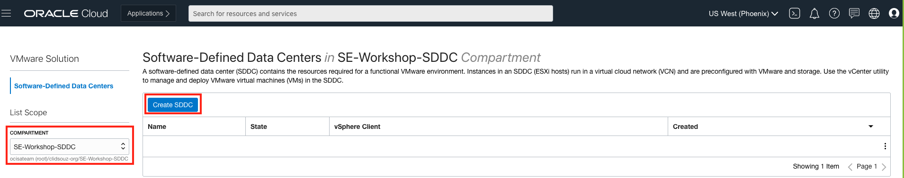

**Note**: Oracle Cloud Infrastructure allows logical isolation of users within a tenancy through Compartments. This allows multiple users and business units to share an OCI tenancy while being isolated from each other.

**If you have chosen a compartment where you do not have the required privileges, then you will not be able to provision the Solution.**

More information about Compartments and Policies is provided in the OCI Identity and Access Management documentation [here](https://docs.cloud.oracle.com/iaas/Content/Identity/Tasks/managingcompartments.htm?tocpath=Services%7CIAM%7C_____13).

-  On the Basic information page, provide the following details:-
    - **SDDC Name**: A descriptive name for the SDDC, such as 'SDDCVMWare'. This name has to be unique among all SDDCs across all compartments in the region. The name must have 1 to 16 characters, must start with a letter, can contain only alphanumeric characters and hyphens (-), and is not case-sensitive.
    - **SDDC Compartment**: The deployment compartment. The destination compartment can be changed from here, as well.
    - **VMware Software Version**: The version of bundled VMware software that you want to install on the ESXi hosts. The software bundle includes vSphere, vSAN, and NSX components. For the purpose of this lab, please select version **6.7**.
    - **Number of ESXi Hosts**: The initial number of ESXi hosts to create in the SDDC. This number has to be at least 3 and can be at most 64. Please choose **3** for this lab.
    
    

    **Note:** The Oracle Cloud VMware Solution supports addition and deletion of ESXi hosts in the SDDC. 
    
    - **Prefix for ESXi Hosts**: (Optional) The optional prefix that you would like to use for the names of the ESXi hosts for identification. This string follows the same rules, as the SDDC name.
    - **SSH Key**: The public key portion of the SSH key that will be used for remote connections to the ESXi hosts. 
    - **Availability Domain**: The availability domain in which the SDDC and the ESXi hosts will be created. The management subnet and VLANs for this SDDC must be in the same availability domain. 
    
    **Note**: ESXi hosts are uniformly distributed across fault domains within the availability domain. 

- Click Next.

    

- On the SDDC Networks page, provide the following values:- 
    - **Virtual Cloud Network (VCN)**: The VCN represents the underlying data center network that hosts the SDDC. The VCN can be in a different compartment than the SDDC and its ESXi hosts. 
    - **Create New Subnet and VLAN**: If the network resources for this SDDC have to be created, then this option has to be selected, otherwise enter the details of the subnet that you wish to use.
    - **SDDC Management CIDR**: An available CIDR block in the selected VCN for the SDDC management CIDR. 
    
    The SDDC Management CIDR is divided into eight segments, one for the provisioning subnet and seven for VLANs. As previously mentioned, the size must be at least /22 to allow the maximum of 64 ESXi hosts to each have their own IP address. Clicking on Check Availability will help ensure that the selected CIDR block is available in the VCN. 
    
    

    - **NSX Network**: The SDDC workload CIDR block. This CIDR block provides the IP addresses in the SDDC to be used by the VMware VMs to run workloads. The value must be /30 or larger and must not overlap with the VCN CIDR block.

        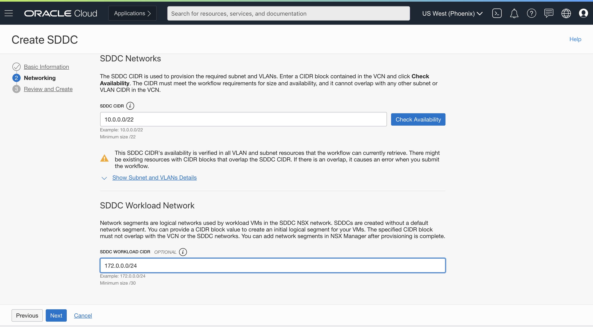

    - Click on **Next** to review a summary of the settings for creating the SDDC. If everything is correct, click on **Create SDDC**.

        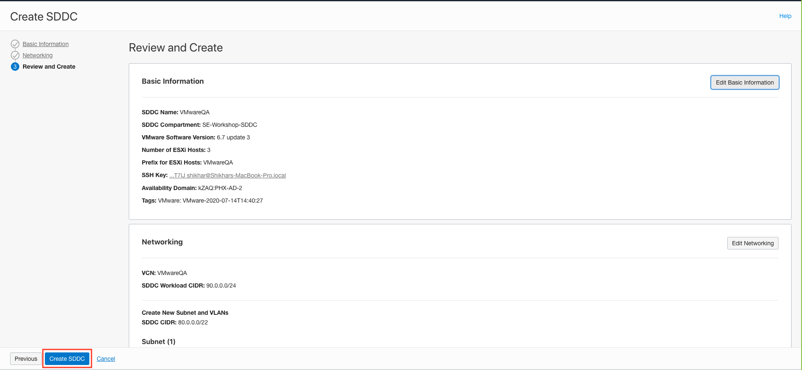

        

    The summary page tells you that the SDDC creation request has been initiated and shows the provisioning status of each resource. The SDDC should be up and running in, roughly, two and a half hours.

    

- To monitor the progress of the SDDC creation, click on the URL at the top of the summary page. The SDDC details page will open. 

    

- Make note of your SDDC's NSX Edge IP Address. You will need it, later, to setup the route rule.

    

### STEP 2: Create a Public Subnet to host the Bastion server

Once the SDDC is up and running, we will need a public compute instance in the same VCN, as the SDDC, to act as the bastion host.

-  We will now create a public subnet to host the bastion server. Go to the navigation menu. Under **Core Infrastructure**, choose **Networking** and then **Virtual Cloud Networks**. 

    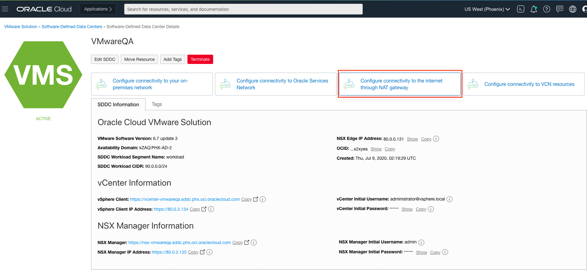

- Select your VCN from the given list. In our case, the following VCN shows up. You could be seeing a longer list.

    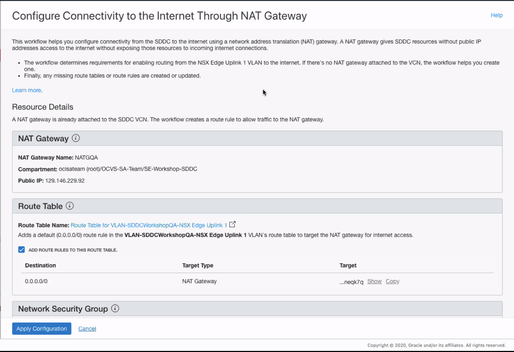

**Note**: At any point of time, during this workshop, if you find that a resource has gone missing, then check if you are in the right region and/or in the right compartment.

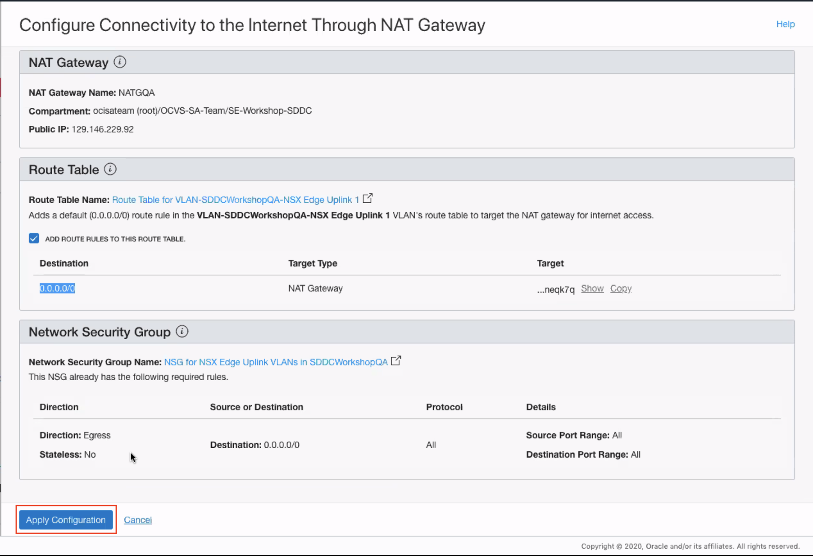

- Click on your VCN and then get to subnets from the menu on the left and click on **Create Subnet**.
    
    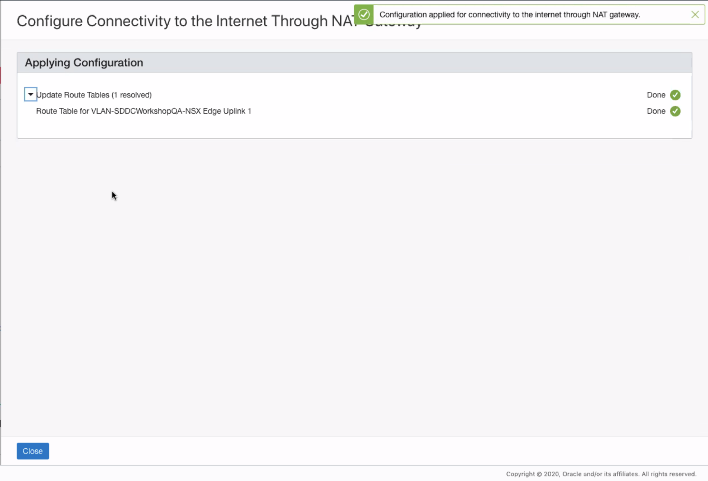

- Give the name as <your-name>-public-subnet and provide a minimum of /30 available CIDR range. Leave all other options as default.

    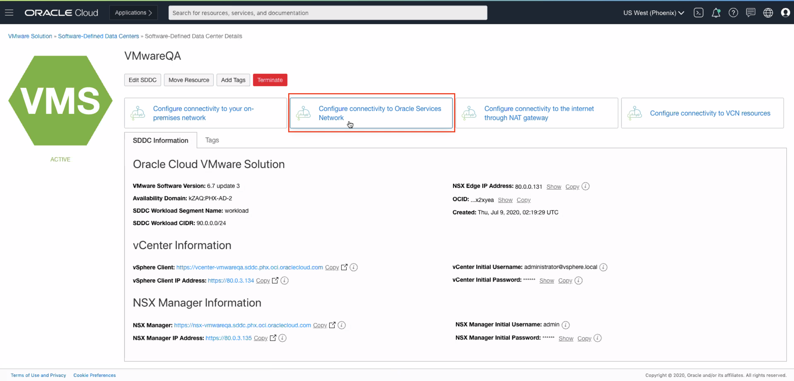

- Click on the **Create Subnet** button. You should now see the public subnet created.

    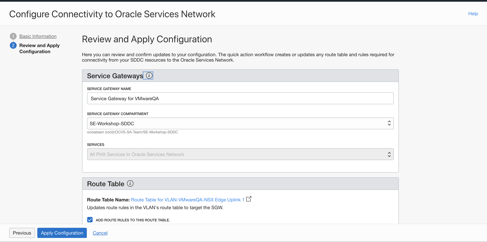
    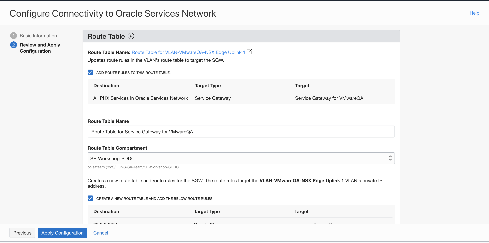

### Step 3: Create a **Network Address Translation (NAT) Gateway**

In order to allow the SDDC which is sittng in a private subnet, to communicate with the internet, we will need a NAT Gateway.

- From the **Resources** section on the left side of the page, select **NAT Gateway**.

    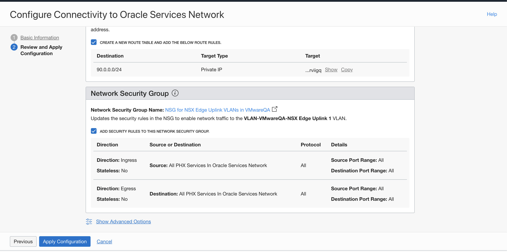
    
- Click on the **Create NAT Gateway** button.

    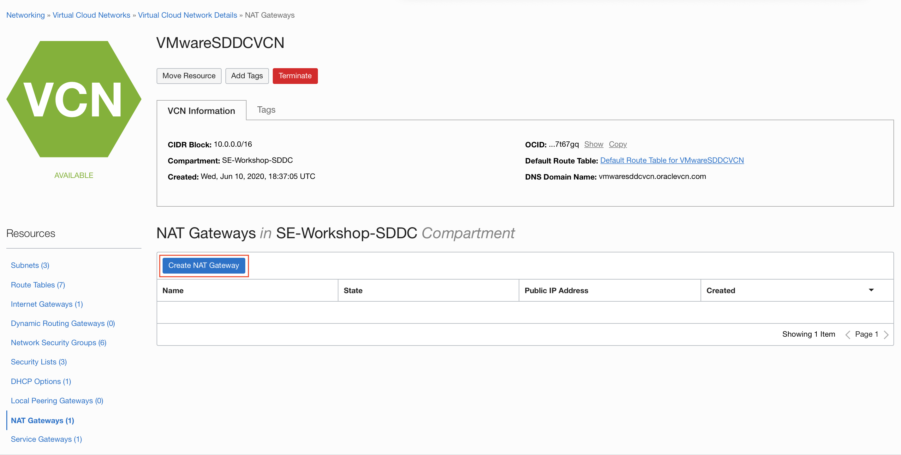

- Provide a name and compartment for the NAT gateway and hit the **Create NAT Gateway** button on the iframe.
    
    

    

You have successfully created a NAT Gateway. Now, let us attach it to the private subnet where your SDDC resides.
    
### Step 4: Attach the **NAT Gateway** to the SDDC subnet

You will now modify the route rules for the SDDC subnet to direct the traffic through the NAT Gateway that you just created.

- From the **Resources** section on the left side of the web page, select **Subnets**.

    

- From the list, select the private subnet.
    
    

- Click on the link to the associated **Route Table** in the panel at the top.

    

- Click on the **Add Route Rules** button.

    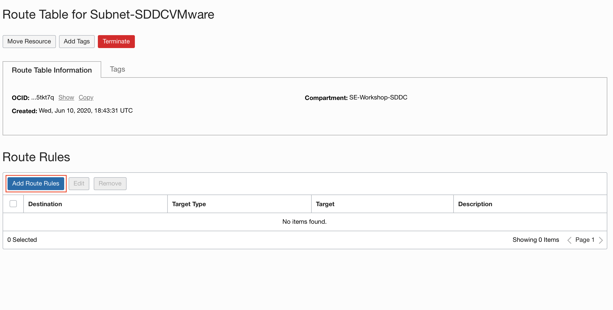

- Select the **Target Type** as **NAT Gateway**, set the **Destination CIDR** as 0.0.0.0/0 and choose the NAT Gateway that you just created as the Target NAT Gateway. 

    

    

    

- Select **Add Additional Route Rule** to add another rule. This time set the **Target Type** as **Private IP**, **Destination CIDR** as 172.0.0.0/24 and **Target** will be the NSX EDge IP Adress that we had copied earlier. After this, click on the **Add Route Rules**.

    

    

    

### STEP 3: Create a Bastion host to access your SDDC

- Open the navigation menu by clicking on the hamburger menu icon on the top left of the screen.

- Under **Core Infrastructure**, click on **Compute** and then on **Instances**.

    

- On the instances page, click on the **Create Instance** button.

    

    

- On the Create Compute Instance page, provide the following values:- 
    - **Name**: The name of the virtual machine. 
    - **Image**: The image/operating system to be used by the virtual machine. We want to use the Windows Server 2016 Standard Image for this machine. 
    
    Clicking on the Change Image button will open a side panel. Scroll down to find the Windows Server 2016 Standard image.

    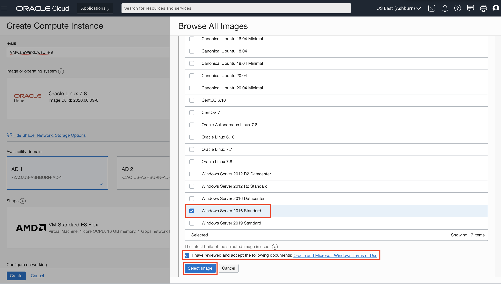

    - **Availability Domain (AD)** - The AD where the instance will be provisioned. 
    - **Shape**: The shape (OCPU / memory) configuraion of the machine. Select a VM.Standard2.1 shape for your compute instance.

    

    

    - **VCN**: Select the same VCN that was used for creating the SDDC. Select a public subnet, so that a public IP is assigned to the Virtual Machine.

    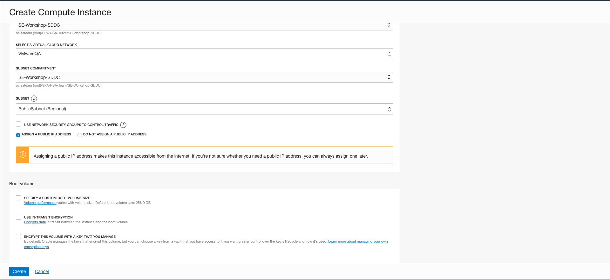

- Click on the **Create** button.

**Upon creating this instance, both a user name and an initial password will be generated for you. They will be available on the details screen of the newly launched Instance. You must create a new password upon logging into the instance for the first time.**

- Once the VM is created, click on your instance for details.

    

- Copy the Public IP address, username and one-time password from the console of the VM. you will need them to establish remote desktop connectivity to the machine. 

    

- Connect to the instance using a Remote Desktop application of your choosing. The screenshots below show the process from a Mac based client.

    

        

        

    

- When you login the first time, you will be asked to set a password. Reset your password and make a note of it.

    

- Now, we will goto the page of our SDDC and we will copy the vSphere Client vCenter URL.

    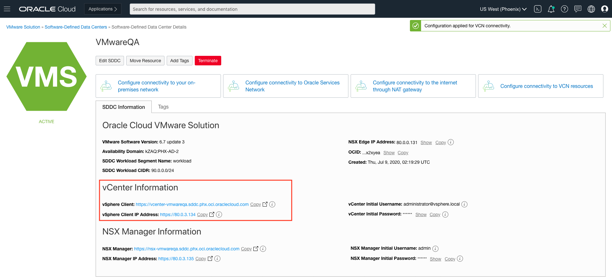

- Within your Windows machine that you have connected to using the RDP clinet, install the chrome browser and paste the **vSphere Client** link.

    

 You will get a warning for unprotected access. Click on **Advanced** and then select the **Proceed** option to continue.

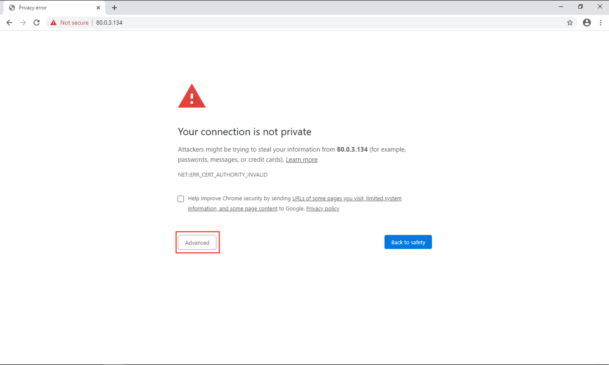

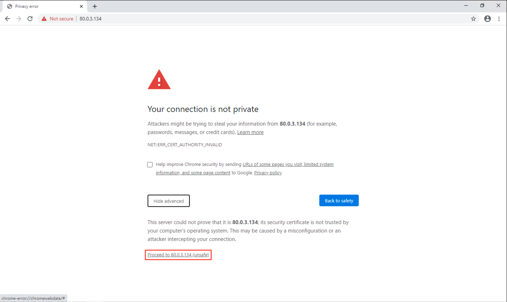

- Click on the **Launch vSphere Client** button.

    

- Here you will need to enter the credential available on the SDDC's OCI console page. Go to the SDDC's console page and copy the **vCenter Username** and **vCenter Initial Password**.

**Note**: You will also get the NSX login information here.

- You should now be able to access the vCenter. From here you can manage the VMware environment.

    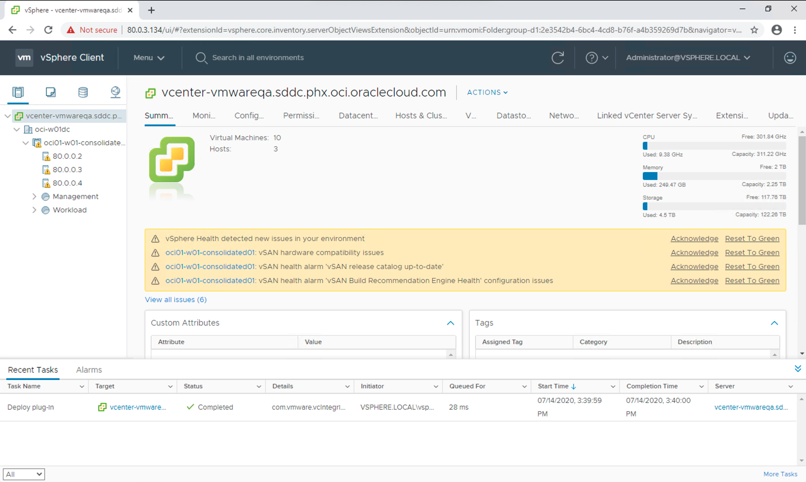

- If you look at the panel on the left, you should be able to see the backend hosts that we used to provision our environment.

    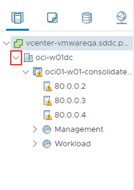
